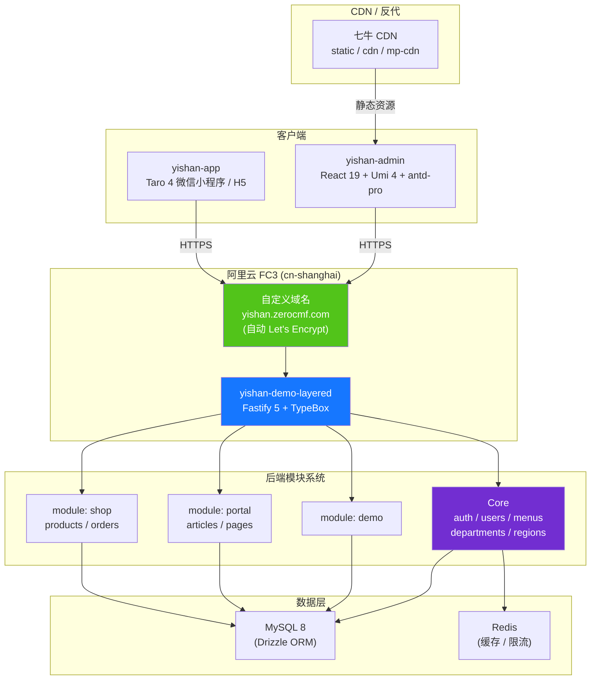

# 移山通用管理系统 (Yishan Universal Management System)

> 为 zerocmf.com 打造的通用管理基座 —— React 19 + Ant Design Pro 6 前端 · Fastify 5 + Drizzle 后端 · 微信小程序 · Docusaurus 文档

[](./LICENSE)
[](https://yishan.zerocmf.com)
[](.tool-versions)
[](package.json)
[](https://www.typescriptlang.org)

## ✨ 它是什么

Yishan（移山）是一个开箱即用的中后台管理系统基座，提供：

- 🧩 **可插拔业务模块** —— `apps/yishan-api/src/modules/<id>/` 自包含的 Fastify 插件，`meta.enabled` 控制运行时启停，无需重新部署
- 🎨 **现代化前端** —— React 19 + UmiJS 4（@umijs/max）+ Ant Design 6 + ProTable，从 OpenAPI 自动生成 API 客户端
- 🗄️ **类型安全后端** —— Fastify 5 + TypeBox（运行时校验）+ Drizzle ORM + JWT，强类型贯穿请求/响应全链路
- 📱 **多端覆盖** —— Web 管理后台、微信小程序（[Taro 4](https://docs.taro.zone/)）、H5 共享同一套后端 API
- 🚀 **云原生部署** —— 阿里云 Function Compute（FC3）+ 七牛 CDN，自动 HTTPS 证书（Let's Encrypt）
- 📚 **完整文档站** —— Docusaurus 3，包含模块开发指南、API 参考、最佳实践

> 📖 **架构与约定**：核心架构决策、模块边界、目录组织详见 [`docs/module-onboarding.md`](docs/module-onboarding.md)（原 `ARCHITECTURE.md` / `AGENTS.md` 内容已合并至此）。贡献流程见 [`CONTRIBUTING.md`](CONTRIBUTING.md)，安全策略见 [`SECURITY.md`](SECURITY.md)。

## 🔗 相关链接

| 链接 | 地址 |
|---|---|
| 🎯 演示站点 | <https://yishan.zerocmf.com> |
| 📘 文档站 | <https://docs.zerocmf.com> |
| 🐙 仓库 | <https://github.com/daifuyang/yishan> |
| 🐛 Issue 反馈 | <https://github.com/daifuyang/yishan/issues> |
| ✉️ 安全报告 | <security@zerocmf.com> |
| 🔑 测试账号 | 请联系维护者按需申请，避免公开固定凭证 |

## 🏗️ 架构



**核心设计原则**：

1. **Core 与 Module 完全隔离** —— Core 永不 import 模块源码，模块之间互不依赖；跨模块读只能走 HTTP 或 Core 扩展
2. **运行时模块启停** —— 通过 `sys_module.enabled` 数据库字段控制（带 Redis 缓存），无需重新部署
3. **路由前缀约定** —— 模块路径硬编码为 `/api/<id>`，菜单路径为 `/<id>/...`（前端不带 `/modules/` 前缀）
4. **OpenAPI 单一真相源** —— 后端 Swagger 描述 → 前端 `pnpm openapi` 自动生成类型与服务

## 📦 项目结构

```
yishan/
├── apps/
│   ├── yishan-admin/                  # 管理后台前端（React 19 + Ant Design Pro 6 + Umi 4）
│   ├── yishan-api/                    # 后端服务（Fastify 5 + Drizzle + TypeBox + JWT）
│   ├── yishan-app/                    # 微信小程序 + H5（Taro 4 + React 18）
│   ├── yishan-docs/                   # 文档站点（Docusaurus 3）
│   └── yishan-components/
│       └── yishan-tiptap/             # TipTap 3 React 组件库（Rollup, CJS/ESM/types/css）
├── package.json
├── pnpm-workspace.yaml
├── .tool-versions                     # Node / pnpm 版本固定
├── LICENSE                            # MIT
├── CONTRIBUTING.md                    # 贡献流程
├── SECURITY.md                        # 安全策略
├── docs/                              # 开发文档（架构、模块开发指南）
└── README.md
```

## ⚙️ 环境要求

| 工具 | 版本 | 说明 |
|---|---|---|
| Node.js | 22.22.1 | 见 `.tool-versions` |
| pnpm | 8.15.9 | 见根 `package.json#packageManager` |
| MySQL | 8.0+ | 后端数据库 |
| Redis | 6.0+ | 缓存 / 限流（可选） |

推荐使用 [asdf](https://asdf-vm.com/) / [mise](https://mise.jdx.dev/) / [fnm](https://github.com/Schniz/fnm) 等工具读取 `.tool-versions` 自动切换 Node 版本。

## 🚀 五分钟启动

```bash
# 1. 安装所有依赖（在仓库根目录）
pnpm install

# 2. 先构建共享组件库（admin 依赖它）
pnpm --filter yishan-tiptap build

# 3. 启动后端（默认 :3000，先启动以便 admin proxy 能命中）
pnpm --filter yishan-api dev

# 4. 启动管理后台（默认 :8000）
pnpm --filter yishan-admin dev

# 5. （可选）启动文档站
pnpm --filter yishan-docs start

# 6. （可选）启动微信小程序（先 cd 到 apps/yishan-app，参考该子项目 README）
```

启动后访问 <http://localhost:8000> 即可看到管理后台。

## 🧩 业务模块系统

Yishan 的核心特色是**模块化业务能力**。每个业务模块自包含于 `apps/yishan-api/src/modules/<id>/`：

```
modules/<id>/
├── module.ts                  # 入口：导出 meta { id, enabled? } 和 Fastify 插件
├── db/schema.ts               # Drizzle 表定义（表名必须以 <id>_ 开头）
├── drizzle.config.ts
├── drizzle/0000_init.sql      # 初始迁移
├── repositories/              # 唯一允许 import Drizzle 表的层
├── services/                  # 业务编排
├── schemas/                   # TypeBox 类型定义
├── routes/                    # Fastify 路由
├── tests/
├── config/system-menu.json    # 模块菜单声明
└── permissions.ts             # 权限点定义
```

**生命周期**：

1. **Boot 扫描** —— `app.ts` 调用 `moduleLoader.scanDiskModules()` 读取每个模块
2. **DB 同步** —— upsert 到 `sys_module` 表（`enabled` 字段首次用 `meta.enabled`，之后永不覆盖）
3. **挂载** —— `@fastify/autoload` 把每个模块的 `routes/` 注册到 `/api/<id>` 前缀
4. **Gate** —— 根实例的 `onRequest` hook 检查 `sys_module.enabled`（Redis 缓存 + 5s 进程内 memo），disabled 模块返回 404

当前内置模块：`demo`（参考实现）、`portal`（文章/页面/模板）、`shop`（商品/订单/SKU）。完整开发指南见 [`docs/module-onboarding.md`](docs/module-onboarding.md)。

## 📜 常用脚本

### 根级别（Monorepo 统一）

```bash
pnpm build        # tiptap → admin → docs 顺序构建
pnpm lint         # admin (Biome + tsc) + docs (typecheck) + app + 模块命名检查
pnpm test         # admin (Jest) + api (Vitest)
```

### `apps/yishan-admin`

```bash
pnpm dev          # Umi 开发服务器（:8000）
pnpm build        # 生产构建
pnpm preview      # 构建后本地预览（:8000）
pnpm openapi      # 从后端 OpenAPI 重新生成前端 API 客户端
pnpm test         # Jest 单元测试
pnpm test:update  # 更新快照
pnpm lint         # max setup + Biome + tsc
```

### `apps/yishan-api`

```bash
pnpm dev          # TS watch + fastify-cli watch
pnpm build:ts     # 构建 TypeScript 产物
pnpm start        # 生产启动
pnpm test         # Vitest
pnpm db:generate  # 从 schema 生成 Drizzle 迁移
pnpm db:migrate   # 应用迁移
pnpm db:seed      # 灌种子数据（含 sys_region 省市区）
pnpm db:reset     # 重建数据库
```

### `apps/yishan-app`

```bash
pnpm dev:h5       # H5 开发模式
pnpm dev:weapp    # 微信小程序开发模式（产物在 dist/，用微信开发者工具打开）
pnpm build:h5     # H5 生产构建
pnpm build:weapp  # 微信小程序生产构建
```

### `apps/yishan-docs` / `apps/yishan-components/yishan-tiptap`

```bash
pnpm --filter yishan-docs start          # Docusaurus dev
pnpm --filter yishan-docs build          # Docusaurus build
pnpm --filter yishan-tiptap build        # Rollup 构建（CJS/ESM/types/css）
pnpm --filter yishan-tiptap dev          # watch 模式
```

## 🛠️ 技术栈

### 前端（`apps/yishan-admin`）

- **框架**：React 19 + TypeScript（严格模式）
- **构建**：UmiJS 4（@umijs/max）
- **UI**：Ant Design 6 + Ant Design Pro（ProTable / ProForm / ProLayout）
- **样式**：Less + antd-style
- **代码规范**：Biome
- **测试**：Jest（单元） + Playwright（部分模块 E2E）
- **API 客户端**：通过 `pnpm openapi` 从后端 OpenAPI 自动生成（类型与服务）

### 后端（`apps/yishan-api`）

- **框架**：Fastify 5
- **类型与校验**：TypeBox（JSON Schema 运行时校验）
- **ORM**：Drizzle + MySQL 8
- **认证**：JWT（Fastify JWT 插件）
- **缓存**：Redis（可选）
- **API 文档**：Swagger / OpenAPI（Swagger UI 实时挂载于 `/api/docs`）
- **测试**：Vitest

### 微信小程序（`apps/yishan-app`）

- **框架**：Taro 4 + React 18
- **多端**：微信小程序 + H5（共享业务代码）
- **设计**：钉钉/飞书 ToB 风格

### 文档（`apps/yishan-docs`）

- **框架**：Docusaurus 3（React 19）
- **类型检查**：TypeScript

### 组件库（`apps/yishan-components/yishan-tiptap`）

- **编辑器**：TipTap 3
- **UI 基座**：Radix UI、Floating UI
- **构建**：Rollup（CJS / ESM / d.ts / css 多产物）

## 🚢 部署

### 阿里云 Function Compute（生产）

CI/CD 通过 GitHub Actions 自动化（`.github/workflows/yishan-fullstack-cd-fc.yml`）：

1. **构建**：根目录 `pnpm install` → `tiptap` build → `admin` build → 后端 TS 编译
2. **打包**：`apps/yishan-api/deploy/fc3/scripts/` 下的 `pre-deploy-layered.sh` 把 admin 静态产物打进函数包
3. **部署**：`s deploy -t deploy/fc3/templates/function.yaml` 推送到 FC3 函数 `yishan-demo-layered`
4. **HTTPS**：`yishan-cert-rotate-fc.yml` 每天 UTC 19:15 检查证书，到期自动通过 `acme.sh --dns dns_ali` 签发并 `s deploy -t domain.yaml` 更新 FC3 自定义域名

### 必需的环境 / 仓库变量

| 类型 | 名称 | 用途 |
|---|---|---|
| 仓库 Variable | `CUSTOM_DOMAIN` | 证书工作流目标域名 |
| 仓库 Variable | `ALIBABA_CLOUD_ACCOUNT_ID` | DNS CNAME 校验 |
| Environment `YISHAN_API` Variable | `FUNCTION_REGION` | FC3 区域（默认 `cn-shanghai`） |
| Environment `YISHAN_API` Variable | `FUNCTION_NAME` | 部署目标函数名 |
| Environment `YISHAN_API` Variable | `CERT_NAME` | 阿里云 SSL 证书名 |
| Environment `YISHAN_API` Variable | `ACME_MODE` | `staging` / `production` |
| GitHub Secret | `ALIBABA_CLOUD_ACCESS_KEY_ID/SECRET` | FC3 + DNS API 凭据 |
| GitHub Secret | `ALI_DNS_ACCESS_KEY_ID/SECRET` | acme.sh dns_ali 凭据 |
| GitHub Secret | `ACME_ACCOUNT_EMAIL` | Let's Encrypt 注册邮箱 |
| GitHub Secret | `QINIU_ACCESS_KEY/SECRET` | CDN 缓存刷新 |

完整部署指南参见 [`apps/yishan-api/deploy/fc3/README.md`](apps/yishan-api/deploy/fc3/README.md) 与 [`docs/environment-variables.md`](apps/yishan-api/deploy/fc3/docs/environment-variables.md)。

## 🤝 贡献流程

1. Fork 仓库后从 `main` 创建特性分支（建议前缀：`feat/`、`fix/`、`docs/`、`refactor/`、`chore/`）
2. 修改前阅读 [`docs/module-onboarding.md`](docs/module-onboarding.md) 与 [`CONTRIBUTING.md`](CONTRIBUTING.md)
3. 提交前跑完改动范围的 `lint` / `test` / `build`（CI 必跑）
4. 遵循 Conventional Commits 提交规范；Husky + lint-staged 已配置（`apps/yishan-admin`）
5. 架构级改动需同步更新根目录文档（本 README / `docs/` / `TODO-*.md`）
6. 不要把 `tmp/` 下的草稿 / 计划文档提交（已 gitignore）

CI 检查清单见 [`CONTRIBUTING.md`](CONTRIBUTING.md) 与 `.github/workflows/yishan-fullstack-ci.yml`。

## 📄 许可证

[MIT License](./LICENSE) · Copyright (c) 2025 zerocmf

---

<p align="center">
  Made with ❤️ by <a href="https://zerocmf.com">zerocmf.com</a>
</p>
